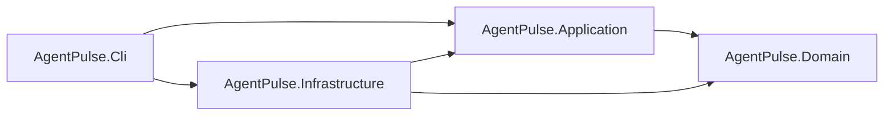

# AgentPulse

**AgentPulse** is an open-source, cross-platform .NET 8 command-line assistant with project-aware prompts, persistent conversations, real-time model streaming, secure endpoint-scoped credentials, Git-aware context, and recovery-safe session state.

The implementation is developed through a 10-phase roadmap. **Phase 7 is complete**: Xiaomi MiMo remains the default provider profile, while the runtime transport is now a single hardened OpenAI-compatible client that supports a configurable endpoint, model, authentication mode, SSE streaming, bounded error parsing, redirect protection, and failure-stage tracking.

> **Development status:** Active development — **8 of 10 phases completed**
> **Current milestone:** Phase 7 — OpenAI-Compatible Provider Generalization and Hardening
> **Default provider profile:** Xiaomi MiMo, model `mimo-v2.5-pro`

> [!WARNING]
> Model API calls may incur usage charges. Review the configured provider's current pricing, account limits, and data-handling terms before running prompts or opt-in live tests.

---

## Current Capabilities

### CLI

- `agentpulse --help`
- `agentpulse run [message...]`
- Prompt input from arguments or redirected `stdin`
- Immediate streaming of model text to `stdout`
- Errors and credential prompts on `stderr`
- A single final newline after successful completion
- `Ctrl+C` cancellation with exit code `130`
- Non-zero exit codes for provider, persistence, configuration, and input failures
- Endpoint-scoped credential commands:
  - `agentpulse auth set`
  - `agentpulse auth status`
  - `agentpulse auth clear`

### OpenAI-Compatible Model Transport

- A single runtime `OpenAiCompatibleChatModelClient` implementation of `IChatModelClient`
- Xiaomi MiMo supplied through the default configuration profile; no provider registry or provider-selection flag
- Configurable absolute base URL, relative Chat Completions path, model, authentication, completion-token limit, thinking extension, and streaming timeouts
- OpenAI-compatible `POST` request with `stream: true` and `stream_options.include_usage: true`
- `IHttpClientFactory`, `HttpCompletionOption.ResponseHeadersRead`, and an infinite `HttpClient.Timeout`
- Automatic HTTP redirects disabled to prevent forwarding credentials to another target
- HTTPS required for remote hosts; HTTP accepted only for loopback test or development endpoints
- Incremental SSE parsing for fragmented frames, fragmented UTF-8, LF/CRLF, comments, keep-alive events, multi-line `data:`, `[DONE]`, deltas, finish reason, and usage
- A single first-byte deadline spanning request start, response headers, and the first body byte
- Distinct stream-idle and bounded error-body read timeouts
- Cancellation propagated through `SendAsync`, response-stream reads, and SSE enumeration
- Provider-independent error taxonomy and `BeforeFirstToken` / `AfterFirstToken` failure stages
- No automatic retry for chargeable streaming requests
- No tools, function calls, plugins, web search, attachments, or reasoning-content persistence

### Default Xiaomi MiMo Profile

```json
{
  "AgentPulse": {
    "Model": {
      "BaseUrl": "https://api.xiaomimimo.com/v1",
      "ChatCompletionsPath": "chat/completions",
      "Model": "mimo-v2.5-pro",
      "AuthenticationMode": "ApiKeyHeader",
      "ApiKeyHeaderName": "api-key",
      "ApiKeyEnvironmentVariable": "MIMO_API_KEY",
      "MaxCompletionTokens": 4096,
      "ThinkingMode": "disabled",
      "IncludeThinkingConfiguration": true,
      "FirstByteTimeout": "00:00:30",
      "StreamIdleTimeout": "00:01:00",
      "ErrorBodyReadTimeout": "00:00:10"
    }
  }
}
```

The Xiaomi profile sends:

```http
api-key: <API_KEY>
```

and preserves the existing request extension:

```json
{
  "thinking": {
    "type": "disabled"
  }
}
```

### Generic OpenAI-Compatible Endpoint

A custom endpoint is selected only through configuration. No new command is required:

```json
{
  "AgentPulse": {
    "Model": {
      "BaseUrl": "https://provider.example/v1",
      "ChatCompletionsPath": "chat/completions",
      "Model": "provider-model",
      "AuthenticationMode": "Bearer",
      "ApiKeyHeaderName": "api-key",
      "ApiKeyEnvironmentVariable": "PROVIDER_API_KEY",
      "MaxCompletionTokens": 4096,
      "ThinkingMode": "disabled",
      "IncludeThinkingConfiguration": false,
      "FirstByteTimeout": "00:00:30",
      "StreamIdleTimeout": "00:01:00",
      "ErrorBodyReadTimeout": "00:00:10"
    }
  }
}
```

PowerShell environment-variable equivalent:

```powershell
$env:AgentPulse__Model__BaseUrl = "https://provider.example/v1"
$env:AgentPulse__Model__ChatCompletionsPath = "chat/completions"
$env:AgentPulse__Model__Model = "provider-model"
$env:AgentPulse__Model__AuthenticationMode = "Bearer"
$env:AgentPulse__Model__ApiKeyEnvironmentVariable = "PROVIDER_API_KEY"
$env:AgentPulse__Model__IncludeThinkingConfiguration = "false"
$env:AgentPulse__Model__ErrorBodyReadTimeout = "00:00:10"
$env:PROVIDER_API_KEY = "..."
```

Supported authentication modes are:

- `Bearer` → `Authorization: Bearer <API_KEY>`
- `ApiKeyHeader` → `<ApiKeyHeaderName>: <API_KEY>`

Sensitive or transport-controlled header names such as `Host`, `Content-Length`, `Transfer-Encoding`, `Connection`, `Upgrade`, proxy authentication headers, cookie headers, `Content-Type`, and `Authorization` are rejected for `ApiKeyHeader` mode. `ApiKeyHeaderName` is ignored in `Bearer` mode. API credentials are trimmed at their outer edges and rejected before any HTTP request when they are empty or contain CR, LF, NUL, tab, DEL, or another control character.

### Configuration Precedence

Non-secret model configuration uses the standard order below, from lowest to highest priority:

1. Default values in code
2. `appsettings.json`
3. `appsettings.{Environment}.json`
4. Environment variables

Environment variables therefore override JSON. The CLI project copies both `appsettings.json` and any existing `appsettings.*.json` files to Build and Publish output with `PreserveNewest`; environment-specific files remain optional. Supported model keys include:

```text
AgentPulse__Model__BaseUrl
AgentPulse__Model__ChatCompletionsPath
AgentPulse__Model__Model
AgentPulse__Model__AuthenticationMode
AgentPulse__Model__ApiKeyHeaderName
AgentPulse__Model__ApiKeyEnvironmentVariable
AgentPulse__Model__MaxCompletionTokens
AgentPulse__Model__ThinkingMode
AgentPulse__Model__IncludeThinkingConfiguration
AgentPulse__Model__FirstByteTimeout
AgentPulse__Model__StreamIdleTimeout
AgentPulse__Model__ErrorBodyReadTimeout
```

The actual API key is deliberately not a bindable option. `OpenAiCompatibleModelOptions` has no `ApiKey` property, and an `ApiKey` value placed in JSON is ignored.

### Secure, Endpoint-Scoped Credentials

Credential resolution for `run` uses this order:

1. The environment variable named by `AgentPulse:Model:ApiKeyEnvironmentVariable`
2. The securely stored credential for the current endpoint scope
3. A hidden interactive prompt

An environment credential is never copied into the credential store. A prompted credential is stored only after a successful streamed provider response begins. A valid scoped stored credential is reused without being rewritten after each successful run. A stored credential rejected with `401` or `403` is removed only from the current endpoint scope.

A credential scope is derived from non-secret endpoint identity:

```text
normalized scheme + normalized host + effective port + authentication mode + API-key header name when applicable
```

The model and base-URL path are intentionally excluded because one key commonly covers multiple models and API paths on the same provider origin. Scheme, port, authentication mode, and API-key header differences create different scopes. Host casing and default ports are normalized.

Changing `BaseUrl` to another host does **not** make the previous credential available to that host. Scoped file names use a SHA-256 digest of the non-secret scope; neither the key nor a key-derived hash appears in the file name or metadata. Credential contents remain protected by ASP.NET Core Data Protection.

A legacy unscoped Phase 6 credential is considered only for the official Xiaomi endpoint. After that credential is accepted successfully by Xiaomi, it is migrated exactly once into the scoped format and the legacy file is removed only after the scoped save succeeds. It remains untouched after a failed provider run and is never migrated or used for a custom host.

CLI help and command descriptions are provider-neutral; Xiaomi appears only as the default configuration profile and optional live-test target.

The `auth` commands always operate on the current configuration scope:

- `auth set` stores or replaces only the current scope
- `auth status` reports only the current scope or configured environment-variable availability
- `auth clear` removes only the current scope and does not change environment variables

No command prints any key fragment, key length, key hash, or complete scope value.

The protected credential root is under the current user's logical local application-data directory:

```text
<LocalApplicationData>/AgentPulse/security/
```

The exact operating-system path is derived at runtime. Credentials are never stored in SQLite, JSON configuration, the repository, Git configuration, or command-line arguments.

### Endpoint and Redirect Security

- `BaseUrl` must be absolute.
- `ChatCompletionsPath` must be relative and cannot contain another scheme, host, query, fragment, backslash, traversal segment, encoded separator, encoded NUL, or single/double-encoded traversal sequence.
- Base URL and relative path are combined without changing origin.
- Remote HTTP endpoints are rejected; loopback HTTP remains available for local contract tests and development.
- `301`, `302`, `303`, `307`, and `308` are converted to provider errors instead of being followed.
- Redirect locations and provider error URLs are sanitized by removing user information, query strings, and fragments.
- Error bodies are read only up to a bounded limit and within `ErrorBodyReadTimeout` (default `00:00:10`); timeout maps to `Timeout / BeforeFirstToken` and user cancellation remains distinct.
- `FirstByteTimeout` is one deadline from `SendAsync` start through response headers and the first body byte; it is not restarted after headers.
- API keys, authorization headers, request bodies, system prompts, and conversation history are not retained in provider exceptions.

### Persistence and Recovery

- Default runtime database path: `<LocalApplicationData>/AgentPulse/data/agentpulse.db`
- Stable user-scoped storage shared by Debug, Release, and published executions
- `AgentPulse__Persistence__DatabasePath` override support
- Design-time migrations use a separate temporary database and never open the user's runtime database by default
- Project, Session, Message, MessagePart, and RunLease domain models
- Entity Framework Core with SQLite and migrations
- User and streaming assistant records committed before provider execution
- Ordered previous history with the current prompt included exactly once
- Immediate delta rendering and exact ordered text accumulation
- Configurable partial flush interval and character threshold
- Final flush on success, cancellation, or failure
- Partial text preserved after a failure or cancellation following the first token
- Failure stage tracked during the current HTTP/SSE run rather than inferred from persisted text
- Session returned to `Idle` on every finalized path
- Independent periodic lease renewal during long streams

### Project Context

- Absolute and relative path resolution
- Current-directory fallback and path normalization
- Git executable, repository root, and worktree discovery
- Stable deterministic project identifiers
- Separate identifiers for distinct worktrees
- Non-Git directory support
- Testable platform, clock, filesystem, Git, and process abstractions

### Architecture and Quality

- Clean Architecture with one-way dependencies
- Domain isolated from HTTP, provider details, SSE, console, credentials, and EF Core
- Application owns provider-independent request, event, failure-stage, and streaming orchestration contracts
- Infrastructure owns the single OpenAI-compatible transport, SSE parser, secure credentials, EF Core, and SQLite
- CLI owns hidden input, configuration composition, console rendering, commands, and exit codes
- Nullable reference types enabled and warnings treated as errors
- Deterministic tests use local HTTP servers and temporary credential/database roots
- Normal tests require neither internet access nor an API key

---

## Technology Stack

| Area | Technology |
|---|---|
| Runtime | .NET 8 |
| Language | C# 12 |
| Architecture | Clean Architecture |
| Hosting and DI | .NET Generic Host and Microsoft.Extensions.DependencyInjection |
| HTTP | `HttpClient` and `IHttpClientFactory` |
| Secret protection | ASP.NET Core Data Protection |
| Persistence | Entity Framework Core 8 |
| Database | SQLite |
| Testing | xUnit |
| Version-control discovery | Git CLI |

---

## Architecture



- `AgentPulse.Domain` has no dependency on other project layers.
- `AgentPulse.Application` depends only on Domain.
- `AgentPulse.Infrastructure` implements Application ports.
- `AgentPulse.Cli` is the Composition Root.
- Application contracts do not expose provider DTOs or API-key handling.
- Runtime resolves exactly one `IChatModelClient`: `OpenAiCompatibleChatModelClient`.

```text
src/
  AgentPulse.Domain
  AgentPulse.Application
  AgentPulse.Infrastructure
  AgentPulse.Cli

tests/
  AgentPulse.Domain.Tests
  AgentPulse.Application.Tests
  AgentPulse.Infrastructure.Tests
  AgentPulse.Cli.IntegrationTests
```

---

## Build and Test

Prerequisites:

- .NET 8 SDK
- Git, recommended for project-context features

```bash
dotnet restore
dotnet build --no-restore -warnaserror
dotnet test --no-build
```

Normal tests use deterministic local HTTP servers and do not call an external provider.

### Optional Live Xiaomi Test

The live test reads only environment variables and never reads the stored credential. It runs only when both `MIMO_API_KEY` is present and `AGENTPULSE_RUN_LIVE_TESTS` is exactly `1`.

PowerShell:

```powershell
$env:MIMO_API_KEY = "..."
$env:AGENTPULSE_RUN_LIVE_TESTS = "1"
dotnet test --no-build --filter "Category=LiveXiaomi"
```

Bash:

```bash
MIMO_API_KEY="..." AGENTPULSE_RUN_LIVE_TESTS="1" \
  dotnet test --no-build --filter "Category=LiveXiaomi"
```

---

## Running AgentPulse

### First Interactive Run

```bash
dotnet run --project src/AgentPulse.Cli -- run "Reply with exactly: Hello"
```

When no credential exists for the current endpoint, the CLI requests it with hidden input. After a successful provider response, it is protected for that endpoint scope.

### Default Xiaomi Environment Variable

PowerShell:

```powershell
$env:MIMO_API_KEY = "..."
dotnet run --project src/AgentPulse.Cli -- run "Explain this project"
```

Bash:

```bash
MIMO_API_KEY="..." dotnet run --project src/AgentPulse.Cli -- run "Explain this project"
```

### Redirected Standard Input

A redirected process cannot securely read a missing credential from the same stream. Configure the current endpoint with `auth set` or its configured API-key environment variable first.

### Credential Commands

```bash
dotnet run --project src/AgentPulse.Cli -- auth set
dotnet run --project src/AgentPulse.Cli -- auth status
dotnet run --project src/AgentPulse.Cli -- auth clear
```

---

## Roadmap

| Phase | Status | Title | Key Capabilities |
|---:|:---:|---|---|
| 0 | ✅ | Behavioral Baseline | Scope, observable behavior, architecture mapping, decisions |
| 1 | ✅ | Solution and CLI Foundation | Generic Host, DI, CLI input, `stdin`, cancellation |
| 2 | ✅ | Domain and Persistence | Entities, SQLite, migrations, repositories, transactions |
| 3 | ✅ | Project Context | Paths, Git discovery, worktrees, deterministic project IDs |
| 4 | ✅ | Session and Message Lifecycle | Ordered history, run lease, recovery, transaction boundaries |
| 5 | ✅ | Model Request Construction | Provider-independent messages, history, project system context |
| 6 | ✅ | Real Xiaomi Streaming and Secure Credentials | Real HTTP streaming, SSE, hidden credentials, partial persistence, full vertical flow |
| 7 | ✅ | OpenAI-Compatible Provider Generalization and Hardening | Generic transport, endpoint scope, redirect defense, error taxonomy, failure stages |
| 8 | ⬜ | Session Continuation and Reliability | Explicit continuation, session selection, recovery and CLI reliability |
| 9 | ⬜ | Final Compatibility, Packaging, and Release | Baseline comparison, process tests, packaging, final documentation, release readiness |

Later phases remain planned and are not marked complete.

---

## Phase 7 Test Coverage

Phase 7 adds or preserves deterministic coverage for:

- Default Xiaomi and generic Bearer provider profiles
- JSON, environment-specific JSON, and environment-variable configuration precedence, plus Build/Publish copy metadata
- Custom endpoint, path, model, authentication mode, header name, and API-key environment-variable name
- Fail-fast validation and absence of a bindable API-key option
- Credential scope normalization and isolation by host, scheme, port, authentication mode, and header name
- Prompt/environment/stored/legacy credential-source persistence rules, one-time legacy migration, and rejection for custom hosts
- Scoped `auth set`, `auth status`, and idempotent `auth clear`
- Redirect status handling and proof that the redirect target receives no request
- Encoded and double-encoded traversal rejection, forbidden header names, and credential control-character rejection
- OpenAI-compatible wrapped and unwrapped JSON errors, text, empty, malformed, and oversized bodies
- Error-body size/deadline enforcement, cancellation distinction, error taxonomy, retry metadata, request ID, and sensitive-data sanitization
- SSE fragmentation, multi-byte UTF-8, multi-line data, completion, usage, malformed and incomplete streams
- One shared first-byte deadline and before/after-first-token failure stages for protocol errors, timeout, and cancellation
- HTTP cancellation observed by the local contract server
- Partial-output preservation in the existing streaming persistence flow
- Explicitly opt-in live Xiaomi connectivity only

---

## Engineering Principles

- Small, reviewable phases
- Provider-independent application contracts
- Infrastructure behind explicit ports
- No secrets in logs, errors, telemetry, test output, or repository files
- No automatic retry of chargeable streaming requests
- Exact ordered persistence of streamed text
- UTC-only stored timestamps
- Cancellation on all asynchronous boundaries
- Database changes only through migrations
- No premature registry, discovery, tools, plugins, agent loops, or source editing

---

## Project Status

```text
Completed: Phase 0 through Phase 7
Progress: 8 / 10 phases
```

---

## Contributing

For bug reports and feature requests, please open a GitHub issue. Pull requests are welcome.

For collaboration or direct coordination, contact [@Alamirpour](https://t.me/Alamirpour) on Telegram.

## Maintainer

AgentPulse is developed and maintained by **Pooya Alamirpour**.

Found an issue or interested in contributing or collaborating? Contact me on Telegram: [@Alamirpour](https://t.me/Alamirpour)

## License

AgentPulse is licensed under the [MIT License](LICENSE).
