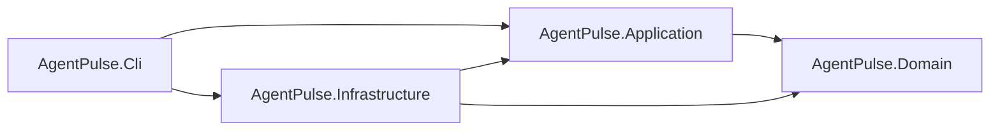

# AgentPulse

**AgentPulse** is an open-source, cross-platform .NET 8 command-line project for building a project-aware AI assistant with persistent conversations, streaming responses, Git-aware context, and reliable recovery from failures or cancellation.

The project is being developed incrementally through a clearly defined 10-phase roadmap. The current implementation has completed **Phase 3**, which means the core architecture, CLI foundation, persistence model, and project-context discovery are in place.

> **Development status:** Active development — **4 of 10 phases completed**  
> **Current milestone:** Phase 3 — Project Context  
> **AI provider status:** Not connected yet; real model streaming is introduced in later phases.

---

## Why AgentPulse?

AgentPulse is designed to provide a clean, testable, and extensible foundation for AI-assisted development workflows without coupling the core application to a specific model provider, database implementation, console framework, or operating system.

The project focuses on:

- Project-aware execution
- Persistent sessions and conversation history
- Streaming model responses
- Reliable cancellation and crash recovery
- OpenAI-compatible provider support
- Deterministic project identification
- Git repository and worktree awareness
- Cross-platform CLI behavior
- Clean Architecture and strict dependency boundaries
- Real integration testing with SQLite, Git, and operating-system processes

---

## Current Capabilities

The following capabilities are already implemented:

### CLI Foundation

- .NET 8 command-line application
- `agentpulse --help`
- `agentpulse run [message...]`
- Prompt input from command-line arguments
- Prompt input from `stdin`
- Clear handling of empty input
- Correct separation of `stdout` and `stderr`
- `Ctrl+C` cancellation support
- Generic Host, dependency injection, configuration, options, and logging
- Explicit non-zero exit codes for failures

### Domain and Persistence

- Domain models for:
  - Project
  - Session
  - Message
  - Message parts
  - Text message parts
- Strongly typed identifiers
- UTC timestamps
- Deterministic message sequencing
- Message states:
  - Pending
  - Streaming
  - Completed
  - Failed
  - Cancelled
- Session states:
  - Idle
  - Running
- Entity Framework Core
- SQLite persistence
- Database migrations
- Foreign-key enforcement
- Required indexes and uniqueness constraints
- Repository abstractions
- Unit of Work and transaction support
- Commit and rollback integration tests

### Project Context

- Absolute and relative path resolution
- Path normalization
- Current-directory fallback
- Validation of missing paths and file paths
- Git executable detection
- Git repository discovery
- Repository-root detection
- Git worktree detection
- Correct handling of repository subdirectories
- Deterministic project identifiers
- Stable identifiers across repeated executions
- Distinct identifiers for separate worktrees
- Valid context creation for non-Git directories
- Graceful behavior when Git is unavailable
- Asynchronous process execution
- Process timeout and cancellation
- Separate capture of process output, errors, and exit codes
- Platform and UTC-date abstraction

### Quality and Architecture

- Clean Architecture
- One-way project dependencies
- Nullable reference types enabled
- Warnings treated as errors
- Domain and Application layers isolated from infrastructure details
- Unit and integration test projects
- Real SQLite integration tests
- Real temporary Git repository and worktree tests
- Naming convention tests
- No dependency on external APIs for automated tests

---

## Planned End-State Capabilities

When the initial roadmap is complete, AgentPulse will support:

- Creating and continuing persistent sessions
- Loading ordered conversation history
- Preventing concurrent runs on the same session
- Recovering abandoned sessions after interruption
- Building provider-independent model requests
- Adding project context to system instructions
- Streaming text to the console as it arrives
- Periodically persisting partial responses
- Preserving incomplete output after errors or cancellation
- Calling OpenAI-compatible model providers
- Configurable API key, model, and base URL
- Robust Server-Sent Events parsing
- Running prompts against a selected directory
- Continuing an existing session by identifier
- Consistent exit codes and CLI behavior
- Crash-safe end-to-end prompt execution

---

## Technology Stack

| Area | Technology |
|---|---|
| Runtime | .NET 8 |
| Language | C# |
| Architecture | Clean Architecture |
| Hosting | .NET Generic Host |
| Dependency Injection | Microsoft.Extensions.DependencyInjection |
| Configuration | Microsoft.Extensions.Configuration and Options |
| Persistence | Entity Framework Core |
| Database | SQLite |
| Testing | xUnit |
| Version-control discovery | Git CLI |
| Process execution | `System.Diagnostics.Process` behind abstractions |
| Planned model transport | `HttpClient` with OpenAI-compatible streaming |

---

## Architecture



### Dependency Rules

- `AgentPulse.Domain` has no dependency on other project layers.
- `AgentPulse.Application` depends only on the Domain layer.
- `AgentPulse.Infrastructure` implements Application abstractions.
- `AgentPulse.Cli` acts as the Composition Root.
- Domain and Application code do not access EF Core, SQLite, the console, real files, environment variables, Git processes, or HTTP clients directly.

### Solution Structure

```text
src/
  AgentPulse.Domain
  AgentPulse.Application
  AgentPulse.Infrastructure
  AgentPulse.Cli

tests/
  AgentPulse.Domain.Tests
  AgentPulse.Application.Tests
  AgentPulse.Infrastructure.Tests
  AgentPulse.Cli.IntegrationTests

docs/
  architecture-decisions.md
  node-behavior-baseline.md
  node-to-dotnet-map.md
```

---

## Getting Started

### Prerequisites

- [.NET 8 SDK](https://dotnet.microsoft.com/download/dotnet/8.0)
- Git, recommended for project-context features

### Build and Test

From the directory containing `AgentPulse.sln`:

```bash
dotnet restore
dotnet build --no-restore -warnaserror
dotnet test --no-build
```

### Run the CLI

Display help:

```bash
dotnet run --project src/AgentPulse.Cli -- --help
```

Pass a prompt as an argument:

```bash
dotnet run --project src/AgentPulse.Cli -- run "Explain this project"
```

Pipe a prompt through standard input:

```bash
echo "Explain this project" | dotnet run --project src/AgentPulse.Cli -- run
```

PowerShell example:

```powershell
"Explain this project" | dotnet run --project src/AgentPulse.Cli -- run
```

> At the current milestone, the CLI validates and accepts prompt input, but it does not call an AI model yet. Model request construction, streaming, provider integration, and complete end-to-end execution are scheduled for later phases.

---

## Roadmap at a Glance

| Phase | Status | Title | Key Capabilities |
|---:|:---:|---|---|
| 0 | ✅ | Behavioral Baseline | Observable behavior, scope, architecture mapping, implementation decisions |
| 1 | ✅ | Solution and CLI Foundation | Solution structure, Generic Host, DI, CLI input, `stdin`, cancellation |
| 2 | ✅ | Domain and Persistence | Domain entities, SQLite, EF Core, migrations, repositories, transactions |
| 3 | ✅ | Project Context | Path normalization, Git discovery, worktrees, stable project identifiers |
| 4 | ✅ | Session and Message Lifecycle | Create/continue sessions, ordered history, run locking, recovery |
| 5 | ⬜ | Model Request Construction | Provider-independent contracts, system context, history conversion |
| 6 | ⬜ | Streaming with a Fake Provider | Stream events, console deltas, partial persistence, cancellation |
| 7 | ⬜ | OpenAI-Compatible Provider | HTTP streaming, SSE parser, configuration, provider error handling |
| 8 | ⬜ | End-to-End Vertical Flow | Full prompt orchestration, persistence, streaming, session continuation |
| 9 | ⬜ | CLI Hardening and Compatibility | Exit codes, crash recovery, edge cases, documentation, final integration tests |

Legend:

- ✅ Completed
- ⬜ Planned

---

## Detailed Development Phases

### ✅ Phase 0 — Behavioral Baseline

- Document externally observable CLI behavior
- Define the initial product scope
- Record architectural decisions
- Map reference behaviors to .NET components
- Separate confirmed behavior from assumptions
- Establish shared development and testing rules

### ✅ Phase 1 — Solution and CLI Foundation

- Create the .NET solution and four main projects
- Add unit and integration test projects
- Enforce Clean Architecture references
- Enable nullable reference types
- Treat warnings as errors
- Configure Generic Host, DI, options, and logging
- Add the `agentpulse run` command
- Read prompts from arguments and `stdin`
- Handle empty input and exit codes
- Connect `Ctrl+C` to cancellation

### ✅ Phase 2 — Domain and Persistence

- Define Project, Session, Message, and MessagePart models
- Add TextMessagePart as the first message-part implementation
- Add strongly typed identifiers
- Store UTC timestamps
- Add deterministic message sequence ordering
- Define session and message state transitions
- Add Entity Framework Core and SQLite
- Add repositories and Unit of Work
- Add the initial migration
- Enforce foreign keys, indexes, and uniqueness
- Test real database transactions, commit, and rollback

### ✅ Phase 3 — Project Context

- Resolve absolute, relative, and empty input paths
- Normalize paths across supported platforms
- Validate directories and provide clear application errors
- Detect Git availability
- Detect repositories, roots, subdirectories, and worktrees
- Generate deterministic project identifiers
- Keep identifiers stable across executions
- Distinguish independent worktrees
- Support non-Git directories
- Add safe async process execution
- Support process timeout and cancellation
- Expose platform and current UTC date through testable abstractions

### ✅ Phase 4 — Session and Message Lifecycle

- Get or create the current Project
- Create a new Session
- Continue a Session by identifier
- Validate that a Session belongs to the current Project
- Save the user message before provider execution
- Create the assistant message before the first token
- Load ordered conversation history
- Prevent two simultaneous runs on one Session
- Recover Sessions abandoned in the Running state
- Define clear transaction boundaries

### ⬜ Phase 5 — Model Request Construction

- Define provider-independent model contracts
- Define stream events, usage, and finish reasons
- Add the model-client abstraction
- Build system context from Project Context
- Convert stored history into model messages
- Add the current user prompt exactly once
- Define handling for failed or incomplete messages
- Keep request construction independent from EF Core and providers

### ⬜ Phase 6 — Streaming with a Fake Provider

- Add a deterministic fake model client
- Stream model events with `IAsyncEnumerable`
- Support text deltas, completion, failure, and usage
- Render deltas immediately in the console
- Accumulate streamed text in the assistant message
- Periodically save partial responses
- Preserve partial text after cancellation or failure
- Avoid creating a transaction for every token
- Add end-to-end tests without external APIs

### ⬜ Phase 7 — OpenAI-Compatible Provider

- Implement the provider with `HttpClient`
- Use `IHttpClientFactory`
- Configure model, API key, and base URL
- Support JSON and environment-based configuration
- Parse fragmented Server-Sent Events safely
- Support multi-line data frames and completion markers
- Extract deltas, finish reasons, and usage
- Convert HTTP failures into application errors
- Stop HTTP requests on cancellation
- Prevent secrets from appearing in logs or exceptions
- Add contract tests with a local test server

### ⬜ Phase 8 — End-to-End Vertical Flow

- Resolve Project Context
- Get or create the Project and Session
- Acquire the Session run lock
- Save the user message
- Create the assistant message
- Build the model request
- Stream and render the response
- Persist partial output periodically
- Complete, cancel, or fail the assistant message
- Release locks on every execution path
- Add directory, model, and session CLI options
- Add complete end-to-end tests

### ⬜ Phase 9 — CLI Hardening and Compatibility

- Compare final behavior with the Phase 0 baseline
- Standardize exit codes
- Verify `stdout` and `stderr` behavior
- Test interactive and non-interactive execution
- Test `stdin`, `Ctrl+C`, invalid directories, and invalid sessions
- Test paths containing spaces
- Test missing configuration and incomplete responses
- Verify crash recovery
- Add configurable logging
- Complete local-run documentation
- Ensure the entire solution builds without warnings
- Ensure all automated tests pass

---

## Beyond the Initial Roadmap

Possible later expansions include:

- File attachments
- Tool contracts
- Read, search, glob, grep, write, and edit tools
- Shell execution
- Permission controls
- Agent loops
- Snapshots and revert support
- Conversation compaction and summaries
- Multiple model providers
- Model Context Protocol integration
- Language Server Protocol integration
- Plugins
- Subagents and actors
- HTTP server and SDK
- Terminal user interface
- Desktop and web interfaces

These capabilities are intentionally outside the current initial roadmap and should only be introduced after the first 10 phases are complete and stable.

---

## Open Source and Contributing

AgentPulse is an open-source project, and community participation is welcome.

Useful contributions include:

- Bug reports
- Test coverage
- Documentation improvements
- Cross-platform compatibility fixes
- Architecture discussions
- Performance improvements
- Pull requests for the active roadmap phase

Before submitting a change:

1. Keep the change within the active phase or an approved issue.
2. Preserve the existing architecture and naming conventions.
3. Avoid unrelated refactoring.
4. Add or update tests.
5. Run the complete validation suite:

```bash
dotnet restore
dotnet build --no-restore -warnaserror
dotnet test --no-build
```

---

## Engineering Principles

- Small, reviewable development phases
- Clear separation of responsibilities
- Provider-independent application contracts
- Infrastructure hidden behind abstractions
- Deterministic persistence and ordering
- UTC-only stored timestamps
- Cancellation support for asynchronous operations
- No secrets in logs, exceptions, or console output
- Database changes only through migrations
- Real integration tests for critical infrastructure
- No premature implementation of later roadmap features

---

## Project Status

```text
Completed:  Phase 0 تا Phase 4
Next:       Phase 5 — Model Request Construction
Progress:   5 / 10 phases
```

AgentPulse is currently a strong architectural foundation rather than a finished AI assistant. The remaining phases will connect session management, model-request construction, streaming, a real provider, and the complete CLI workflow.
