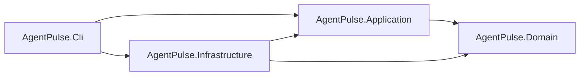

# AgentPulse

**AgentPulse** is an open-source, cross-platform .NET 8 command-line assistant with project-aware prompts, persistent conversations, real-time model streaming, secure credential storage, Git-aware context, and recovery-safe session state.

The implementation is developed through a 10-phase roadmap. **Phase 6 is complete**: `agentpulse run` now connects to Xiaomi MiMo through its OpenAI-compatible Chat Completions endpoint, renders text deltas immediately, persists partial output safely, renews the run lease, and finalizes cancelled or failed runs without discarding received text.

> **Development status:** Active development — **7 of 10 phases completed**  
> **Current milestone:** Phase 6 — Real Xiaomi MiMo Streaming and Secure Credentials  
> **Provider:** Xiaomi MiMo, default model `mimo-v2.5-pro`

> [!WARNING]
> Calls to the Xiaomi MiMo API may incur usage charges. Review the provider's current pricing and account limits before running prompts or opt-in live tests.

---

## Current Capabilities

### CLI

- `agentpulse --help`
- `agentpulse run [message...]`
- Prompt input from arguments or redirected `stdin`
- Immediate streaming of model text to `stdout`
- Errors and credential prompts on `stderr`
- A single final newline after successful completion
- `Ctrl+C` cancellation with exit code `130`
- Non-zero exit codes for provider, persistence, configuration, and input failures
- Credential commands:
  - `agentpulse auth set`
  - `agentpulse auth status`
  - `agentpulse auth clear`

### Xiaomi MiMo Provider

- OpenAI-compatible `POST /chat/completions`
- Default base URL: `https://api.xiaomimimo.com/v1`
- Default model: `mimo-v2.5-pro`
- Per-request `api-key` authentication header
- `stream: true`
- `max_completion_tokens: 4096`
- `thinking.type: disabled`
- `IHttpClientFactory` and `HttpCompletionOption.ResponseHeadersRead`
- Incremental Server-Sent Events parsing without buffering the complete response
- Distinct first-byte and stream-idle timeouts
- Cancellation propagated through HTTP and stream reads
- No automatic retry for streaming requests
- No tools, function calls, plugins, web search, attachments, or reasoning-content persistence

### Secure Credentials

Credential resolution order for `run`:

1. `MIMO_API_KEY` environment variable
2. Securely stored user credential
3. Hidden interactive prompt

The first interactive `run` without a configured key displays:

```text
Xiaomi MiMo API key was not found.
Enter MIMO_API_KEY:
```

The API key is entered without echo. A prompted key is stored only after Xiaomi returns a successful HTTP `2xx` response. Environment credentials are never copied into the credential store. If a stored credential receives `401` or `403`, it is removed so the next run can request a replacement.

The credential is protected in the current user's local application-data scope under the logical path:

```text
<LocalApplicationData>/AgentPulse/security/
```

The exact operating-system path is derived at runtime. The protected credential is never stored in `appsettings`, SQLite, the repository, Git configuration, a command-line argument, or a plaintext credential file. Windows key-ring protection uses user-scoped DPAPI. Unix directories and files are restricted to the current user.

### Persistence and Recovery

- Default runtime database path: `<LocalApplicationData>/AgentPulse/data/agentpulse.db`
- Stable user-scoped storage shared by Debug, Release, and published executions
- `AgentPulse__Persistence__DatabasePath` override support; relative overrides are normalized against the current working directory
- Design-time migrations use a separate temporary database and never open the user's runtime database by default
- Project, Session, Message, MessagePart, and RunLease domain models
- Entity Framework Core with SQLite and migrations
- User message committed before provider execution
- Streaming assistant message and empty text part committed before the HTTP request
- Ordered previous history with the current prompt included exactly once
- Immediate delta rendering and exact ordered text accumulation
- Configurable partial flush interval and character threshold
- Final flush on success, cancellation, or failure
- Partial text preserved after cancellation or provider failure
- Session returned to `Idle` on every finalized path
- Lease released only by its owner
- Independent periodic lease renewal during long streams
- Provider cancellation, HTTP errors, malformed SSE, incomplete streams, and lost leases mapped to safe failures

### Project Context

- Absolute and relative path resolution
- Current-directory fallback and path normalization
- Git executable, repository root, and worktree discovery
- Stable deterministic project identifiers
- Separate identifiers for distinct worktrees
- Non-Git directory support
- Testable platform, clock, filesystem, Git, and process abstractions

### Architecture and Quality

- Clean Architecture with one-way dependencies
- Domain isolated from HTTP, Xiaomi, SSE, console, credentials, and EF Core
- Application owns provider-independent streaming orchestration and flush policy
- Infrastructure owns Xiaomi transport, SSE, secure credentials, EF Core, and SQLite
- CLI owns hidden input, console rendering, commands, and exit codes
- Nullable reference types enabled
- Warnings treated as errors
- Automated tests use local HTTP servers and temporary credential/database roots
- Normal tests require neither internet access nor an API key

---

## Technology Stack

| Area | Technology |
|---|---|
| Runtime | .NET 8 |
| Language | C# |
| Architecture | Clean Architecture |
| Hosting and DI | .NET Generic Host and Microsoft.Extensions.DependencyInjection |
| HTTP | `HttpClient` and `IHttpClientFactory` |
| Secret protection | ASP.NET Core Data Protection |
| Persistence | Entity Framework Core 8 |
| Database | SQLite |
| Testing | xUnit |
| Version-control discovery | Git CLI |

---

## Architecture



- `AgentPulse.Domain` has no dependency on other project layers.
- `AgentPulse.Application` depends only on Domain.
- `AgentPulse.Infrastructure` implements Application ports.
- `AgentPulse.Cli` is the Composition Root.
- Application contracts do not expose Xiaomi-specific DTOs or API-key handling.

```text
src/
  AgentPulse.Domain
  AgentPulse.Application
  AgentPulse.Infrastructure
  AgentPulse.Cli

tests/
  AgentPulse.Domain.Tests
  AgentPulse.Application.Tests
  AgentPulse.Infrastructure.Tests
  AgentPulse.Cli.IntegrationTests
```

---

## Build and Test

Prerequisites:

- .NET 8 SDK
- Git, recommended for project-context features

```bash
dotnet restore
dotnet build --no-restore -warnaserror
dotnet test --no-build
```

Normal tests use deterministic local HTTP servers and do not call Xiaomi or require `MIMO_API_KEY`.

### Optional Live Xiaomi Test

The live test reads **only** environment variables and never reads the user's stored credential. It runs only when both `MIMO_API_KEY` is present and `AGENTPULSE_RUN_LIVE_TESTS` is exactly `1`. This explicit second flag prevents a normal `dotnet test` from making a paid request when an API key is permanently configured.

PowerShell:

```powershell
$env:MIMO_API_KEY="..."
$env:AGENTPULSE_RUN_LIVE_TESTS="1"
dotnet test --no-build --filter "Category=LiveXiaomi"
```

Bash:

```bash
MIMO_API_KEY="..." AGENTPULSE_RUN_LIVE_TESTS="1" \
  dotnet test --no-build --filter "Category=LiveXiaomi"
```

---

## Running AgentPulse

### First Interactive Run

```bash
dotnet run --project src/AgentPulse.Cli -- run "Reply with exactly: Hello"
```

When no credential exists, the CLI requests it with hidden input. After a successful `2xx` provider response, it is protected in the current user's credential store. A later run reuses it without another prompt.

### Environment Variable

PowerShell:

```powershell
$env:MIMO_API_KEY="..."
dotnet run --project src/AgentPulse.Cli -- run "Explain this project"
```

Bash:

```bash
MIMO_API_KEY="..." dotnet run --project src/AgentPulse.Cli -- run "Explain this project"
```

### Redirected Standard Input

A redirected process cannot securely read a missing API key from the same stream. Configure a stored credential or `MIMO_API_KEY` first:

```powershell
$env:MIMO_API_KEY="..."
"Explain this project" | dotnet run --project src/AgentPulse.Cli -- run
```

Without either credential source, the CLI exits non-zero and directs the user to set `MIMO_API_KEY` or run `agentpulse auth set`.

### Credential Commands

Store or replace a credential with hidden input:

```bash
dotnet run --project src/AgentPulse.Cli -- auth set
```

Show only the configured source status, never key metadata:

```bash
dotnet run --project src/AgentPulse.Cli -- auth status
```

Remove the stored credential without changing the environment variable:

```bash
dotnet run --project src/AgentPulse.Cli -- auth clear
```

---

## Configuration

Non-secret provider settings can be overridden through configuration or environment variables:

```text
AgentPulse:Xiaomi:BaseUrl
AgentPulse:Xiaomi:Model
AgentPulse:Xiaomi:MaxCompletionTokens
AgentPulse:Xiaomi:ThinkingMode
AgentPulse:Xiaomi:FirstByteTimeout
AgentPulse:Xiaomi:StreamIdleTimeout
AgentPulse:Streaming:FlushInterval
AgentPulse:Streaming:FlushCharacterThreshold
AgentPulse:Streaming:LeaseRenewInterval
AgentPulse:Persistence:DatabasePath
```

Environment-variable examples use double underscores, such as:

```text
AgentPulse__Xiaomi__BaseUrl
AgentPulse__Xiaomi__Model
AgentPulse__Persistence__DatabasePath
```

The default database is stored in the current user's local application-data directory. At runtime, an absolute override is used directly and a relative override is normalized against the process current directory. At design time, an override must be absolute; relative paths are rejected to prevent database creation inside the repository. `MIMO_API_KEY` is intentionally separate from bindable JSON options.

---

## Roadmap

| Phase | Status | Title | Key Capabilities |
|---:|:---:|---|---|
| 0 | ✅ | Behavioral Baseline | Scope, observable behavior, architecture mapping, decisions |
| 1 | ✅ | Solution and CLI Foundation | Generic Host, DI, CLI input, `stdin`, cancellation |
| 2 | ✅ | Domain and Persistence | Entities, SQLite, migrations, repositories, transactions |
| 3 | ✅ | Project Context | Paths, Git discovery, worktrees, deterministic project IDs |
| 4 | ✅ | Session and Message Lifecycle | Ordered history, run lease, recovery, transaction boundaries |
| 5 | ✅ | Model Request Construction | Provider-independent messages, history, project system context |
| 6 | ✅ | Real Xiaomi Streaming and Secure Credentials | HTTP/SSE streaming, hidden credential input, partial persistence, heartbeat, full vertical flow |
| 7 | ⬜ | Session Continuation and CLI Expansion | Explicit continuation, session selection, and scoped CLI options |
| 8 | ⬜ | Reliability, Recovery, and Provider Hardening | Additional crash recovery, compatibility, and provider edge cases |
| 9 | ⬜ | Final Compatibility, Packaging, and Release | Baseline comparison, packaging, final documentation, and release readiness |

Later phases remain planned and are not marked complete.

---

## Phase 6 Test Coverage

Phase 6 adds deterministic coverage for:

- Credential resolution priority, hidden input, empty input, and cancellation
- `auth set`, `auth status`, and idempotent `auth clear`
- Encrypted credential persistence, corruption, atomic replacement, and Unix modes
- Prompted-key persistence after `2xx` and stored-key removal after `401`/`403`
- SSE fragmentation, multi-byte UTF-8, LF/CRLF, comments, multi-line data, usage, finish reasons, malformed JSON, incomplete streams, repeated completion, unsupported tool calls, and ignored reasoning content
- Local HTTP transport requests, headers, DTO shape, `401`, `403`, `429`, `500`, partial disconnects, malformed data, first-byte timeout, idle timeout, and user cancellation
- Streaming orchestration, exact delta concatenation, flush policy, partial failure/cancellation, finalization failures, heartbeat renewal, and lost leases
- SQLite end-to-end vertical flow proving pre-request commits, separate `Hel`/`lo` rendering, final `Hello` persistence, completed message, idle session, and released lease
- Explicitly opt-in live Xiaomi connectivity requiring both `MIMO_API_KEY` and `AGENTPULSE_RUN_LIVE_TESTS=1`

---

## Engineering Principles

- Small, reviewable phases
- Provider-independent application contracts
- Infrastructure behind explicit ports
- No secrets in logs, errors, telemetry, test output, or repository files
- No automatic retry of chargeable streaming requests
- Exact ordered persistence of streamed text
- UTC-only stored timestamps
- Cancellation on all asynchronous boundaries
- Database changes only through migrations
- No premature tools, plugins, agent loops, or source editing

---

## Project Status

```text
Completed:  Phase 0 through Phase 6
Next:       Phase 7 — Session Continuation and CLI Expansion
Progress:   7 / 10 phases
```
---

## Contributing

For bug reports and feature requests, please open a GitHub issue. Pull requests are welcome.

For collaboration or direct coordination, contact [@Alamirpour](https://t.me/Alamirpour) on Telegram.

## Maintainer

AgentPulse is developed and maintained by **Pooya Alamirpour**.

Found an issue or interested in contributing or collaborating? Contact me on Telegram: [@Alamirpour](https://t.me/Alamirpour)

## License

AgentPulse is licensed under the [MIT License](LICENSE).

